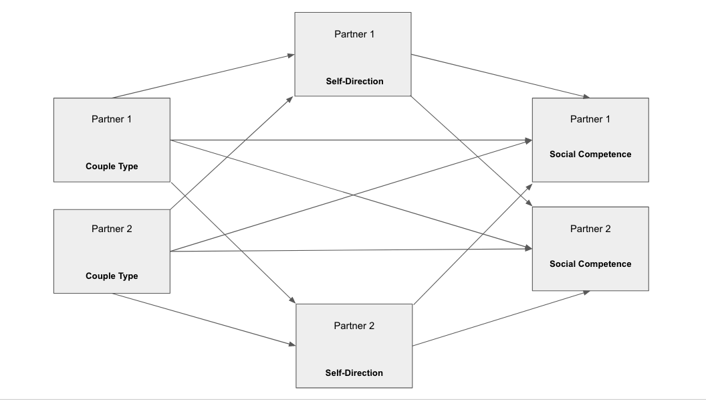

```{r setup, include = FALSE}
library(papaja)
library(psysds364data)
library(tidyverse)
library(psych)
library(nlme)
library(mosaic)
library(stargazer)
```

```{r analysis-preferences}
# Seed for random number generation
set.seed(42)
knitr::opts_chunk$set(cache.extra = knitr::rand_seed)
knitr::opts_chunk$set(warning = FALSE, message = FALSE)
```


```{r select_variables}
Goldberg_gav_sm <- Goldberg_gav %>%
  select(ID,
         Partner,
         group,
         gender,
         h12selfdir,
         #h12conform,
         SocComp
         )
```

```{r subset_data}
#exclude individuals who do not have data for parental values or social competence

#find the subset of dyads who have information for both people for all of the variables
Goldberg_gav_completes <- Goldberg_gav_sm %>%
  filter(!is.na(SocComp) & !is.na(h12selfdir)) %>%
  group_by(ID) %>%
  count() %>%
  filter(n == 2)

#join this subset with the full set of individuals
Goldberg_gav_sm <- Goldberg_gav_sm %>%
  inner_join(Goldberg_gav_completes, by = "ID")
```


```{r impute_data}
#impute gender 3 to gender 1
Goldberg_gav_sm <- Goldberg_gav_sm %>%
  #mutate(w11RelDur = ifelse(ID == 231 & Partner == 2, 7.0, w11RelDur)) %>%
  mutate(gender = ifelse(gender == 3, 1, gender))

#NA gender goes to 1
Goldberg_gav_sm$gender[is.na(Goldberg_gav_sm$gender)] <- 1
```

```{r pairwise}
#Impute partner number for second person in dyad 53:
Goldberg_gav_sm[38, 2] = 2
#Impute partner number for second person in dyad 247:
Goldberg_gav_sm[153, 2] = 1

# Pairwise data
tempA <- Goldberg_gav_sm %>%
  mutate(
    genderE = gender,
    partnum = 1,
    Partner = case_when(
      Partner == 1 ~ "A",
      Partner == 2 ~ "P")) %>%
  select(-n) %>%
  gather(variable, value, group:genderE) %>%
  unite(var_partner, variable, Partner) %>%
  spread(var_partner, value)

tempB <- Goldberg_gav_sm %>%
  mutate(
    genderE = gender,
    partnum = 2,
    Partner = case_when(
      Partner == 1 ~ "P",
      Partner == 2 ~ "A")) %>%
  select(-n, -gender, group) %>%
  gather(variable, value, group:genderE) %>%
  unite(var_partner, variable, Partner) %>%
  spread(var_partner, value)

pairwise <- bind_rows(tempA, tempB) %>%
  select(-gender_A, -gender_P, -group_P) %>%
  rename(group = group_A) %>%
  arrange(ID) %>%
  janitor::clean_names()


```


```{r center_vars}
pairwise <- pairwise %>%
  mutate(h12selfdir_a_ctr = h12selfdir_a - mean(h12selfdir_a),
         h12selfdir_p_ctr = h12selfdir_p - mean(h12selfdir_p),
         soc_comp_a_ctr = soc_comp_a - mean(soc_comp_a),
         soc_comp_p_ctr = soc_comp_p - mean(soc_comp_p))

pairwise <- pairwise %>%
  mutate(samesex = ifelse(group == 1 | group == 2, 1, 0))

```


```{r moderation_models}

#simply use the group variable
moderation <- gls(soc_comp_a ~ as.factor(group) +
                    h12selfdir_a_ctr:as.factor(group) +
                    h12selfdir_p_ctr:as.factor(group) - 1,
                  data = pairwise,
                  correlation = corCompSymm(form = ~1|id),
                  na.action = na.omit)

# summary(moderation)
# coef(summary(moderation))

moderation2 <- gls(soc_comp_a ~ as.factor(samesex) +
                    h12selfdir_a_ctr:as.factor(samesex) +
                    h12selfdir_p_ctr:as.factor(samesex) - 1,
                  data = pairwise,
                  correlation = corCompSymm(form = ~1|id),
                  na.action = na.omit)

# summary(moderation2)
# coef(summary(moderation2))

moderation_test <- gls(soc_comp_a ~ h12selfdir_a_ctr*as.factor(samesex) +
                    h12selfdir_p_ctr*as.factor(samesex),
                  data = pairwise,
                  correlation = corCompSymm(form = ~1|id),
                  na.action = na.omit)

# summary(moderation_test)
# coef(summary(moderation_test))
```

```{r}
#
```


# Results

## Analysis Strategy

We hypothesized that the amount that one parent in a dyad values self-direction in their child moderates the relationship between the couple type and the individual’s perception of their child’s social competence. We hypothesized that parent’s valuing self-direction more highly would perceive greater social competence in their children. We also hypothesized that same-sex couples would value self-direction more highly than heterosexual couples. We used multilevel modeling and the Actor-Partner Interdependence Model [@kenny2006dyadic] to test these hypotheses. We developed our APIM (see Figure 1) to estimate the effects of couple type on PPCSC (Parent’s Perception of their Child’s Social Competence). In order to understand these possible effects, the present study’s APIM incorporates the self direction parental value as a moderating variable.

In our model, depicted in Figure 1, the arrows represent the various ways that we predict our variables may influence each other. Working from the most standard APIM model, our model includes moderation, which adds an additional variable for each partner. Therefore, in our diagram, there are six boxes, instead of the standard four in a typical APIM which only investigates the effects of an actor and their partner on a single outcome variable. If our model did not include moderation and only investigated, for example, the relationship between Couple Type and PPCSC, the arrow between Partner 1 Couple Type and Partner 1 PPCSC would represent an actor effect, and the arrow between Partner 2 Couple Type and Partner 1 PPCSC would represent a partner effect. These relationships are still present in our actual model, with the addition of the moderating variable of Self-Direction. Each arrow in our model represent a specific actor-or partner relationship between variables. The addition of Self-Direction as a moderating variable allowed for added complexity of the model and an increase in the relationships between variables that we could examine. These relationships are explored more below.  To arrive at our final model we first included the following explanatory variables: actor's values, partner’s values, and couple type. We also analyzed the relationship between values of self-direction and PPCSC.
 
Our initial model started by looking at the relationship between parental values of self-direction and PPCSC between the three couple types in the data: lesbian couples, gay male couples, and heterosexual couples. The direction of the estimates were the same for lesbian couples and gay male couples. As none of these estimates were statistically significant (*alpha = 0.05*) we reduced the model in an effort to build a parsimonious model that looked exclusively at whether the couple was a same-sex couple or a heterosexual couple. Thus, our final model analyzes the moderation of parental values of self-direction between PPCSC and same-sex vs. heterosexual couples. 

## Main Results

See Table 1 for model results. Contrary to our hypotheses, there was not a significant difference between same-sex couples and heterosexual couples in the relationship between parental values of self-direction and PPCSC for either the actor or the partner.  For heterosexual couples, the actor’s parental values of self-direction had a slightly positive, but insignificant effect on PPCSC (*b = 0.030*, *SE = 0.023*, *p = 0.20*). For same-sex couples, the actor’s parental values of self-direction had a slightly negative, but insignificant effect on PPCSC (*b = -0.0022*, *SE =	0.017*, *p = 0.90*). For heterosexual couples, the partner’s parental values of self-direction had a slightly positive, but insignificant effect on PPCSC (*b = 0.012*, *SE = 0.023*,	*p = 0.59*). For same-sex couples, the partner’s parental values of self-direction had a slightly negative, but insignificant effect on PPCSC (*b = -0.0097*, *SE = 0.017*, *p = 0.57*). 


```{r moderation2table, results = "asis"}
moderation2table <- tribble(
  ~"Self-Direction", ~"Dependent Variable: Perception of child's social competence",
"Heterosexual couples", "2.270*** (0.106)",
"Same-sex couples", "2.306*** (0.083)",
"Heterosexual couple actor effect", "0.030 (0.023)",
"Same-sex couple actor effect",	"-0.002 (0.017)",
"Heterosexual couple partner effect", "0.012 (0.023)",
"Same-sex couple partner effect",	"-0.010 (0.017)")

apa_table(
  moderation2table
  , caption = "APIM results."
  , note = "*p<0.1; **p<0.05; ***p<0.01."
  , escape = TRUE
)


```

\newpage

# References
```{r create_r-references}
r_refs(file = "r-references.bib")
```

\begingroup
\setlength{\parindent}{-0.5in}
\setlength{\leftskip}{0.5in}

<div id = "refs"></div>
\endgroup
